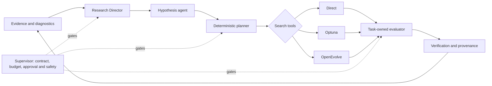

# Auto Researcher

Auto Researcher is a typed, resumable control plane for bounded,
evidence-driven scientific research. It coordinates specialist agents,
deterministic safety gates and multiple search engines while keeping scientific
execution inside domain-owned task adapters.

The platform is designed for long-running research that must survive
interruptions, preserve provenance and distinguish proposed ideas from verified
experimental evidence. The default installation and test suite are offline;
live models, external knowledge sources, GPUs and scientific datasets are
explicit optional capabilities.

- Repository: [Lifework-Health/auto-researcher](https://github.com/Lifework-Health/auto-researcher)
- Issues: [report a problem or propose an enhancement](https://github.com/Lifework-Health/auto-researcher/issues)
- Current release: `v2.2.0`

## How it works



LangGraph owns the durable workflow. The Research Director chooses the next
scientific question when configured campaign triggers fire. The hypothesis
agent proposes a testable explanation, and the deterministic planner compiles
that intent into a registered, bounded request. Direct, Optuna and OpenEvolve
then search only within the active task's permitted surface. The Supervisor,
verifier and provenance layer remain deterministic.

## Core capabilities

| Area | Implemented capability |
|---|---|
| Orchestration | Typed LangGraph state, start/resume/inspect lifecycle, SQLite checkpoints and terminal replay |
| Research agents | Bounded Research Director, hypothesis and planner calls with structured output, durable call records, budgets and deterministic reconciliation |
| Search | Direct execution, native Optuna ask/tell and bounded OpenEvolve with identity, lineage and resume support |
| Scientific plugins | Task-owned configurations, manifests, evaluators, metrics, constraints, verification and artefact policy |
| Evidence | Structural verification, task verification policy, provenance events, evidence lineage and research-state records |
| Knowledge | Static grounding, read-only Neo4j integration, evidence cards and a provenance-bound literature-scout boundary |
| Operations | ResourceBroker leases, SQLite or PostgreSQL coordination, managed-secret references and courteous GPU admission |
| Safety | Explicit approval, cost and experiment budgets, fail-closed readiness, protected holdout boundaries and hardened OpenEvolve execution options |

## Included tasks and benchmarks

| Task | Purpose | Search modes |
|---|---|---|
| `synthetic` | Deterministic offline landscape for development and CI | Direct, Optuna, OpenEvolve |
| `iris_knn` | Public, non-patient weighted k-NN benchmark | Direct, Optuna, OpenEvolve |
| `icca_nbs` | Adapter to the external iCCA network-based stratification implementation | Direct, Optuna |
| `feta_seg` | Locked 3D SegResNet baseline | Direct |
| `feta_seg_evolve` | FeTA SegResNet training-policy evolution | Direct, OpenEvolve |
| `feta_seg_search` | FeTA SegResNet development search | Direct, Optuna |
| `feta_unet_direct` | FeTA BasicUNet direct baselines | Direct |
| `feta_unet_search` | Structural BasicUNet, DynUNet, attention and transformer-family development | Direct, Optuna, OpenEvolve |

FeTA diagnostics, probability ensembling, five-fold confirmation and the
one-time final-holdout evaluator are implemented as separately bounded
sidecars. Scientific datasets, checkpoints, predictions and private subject
records are not stored in this repository.

The ARC Virtual Cell 2026 foundation freezes Viet Tran's submitted baseline,
the official scorer identity and known readiness blockers. It intentionally
does not copy challenge data or submission payloads and will not permit a new
campaign until those inputs are bound. See the
[VCC 2026 foundation runbook](docs/runbooks/VCC2026_BASELINE_FOUNDATION.md).

## Installation

Auto Researcher requires Python 3.11 or later.

```bash
git clone https://github.com/Lifework-Health/auto-researcher.git
cd auto-researcher
python -m venv .venv
.venv/bin/pip install -r requirements.lock
.venv/bin/pip install -e . --no-deps
```

Install only the capabilities needed for a run:

```bash
.venv/bin/pip install -e '.[dev]'
.venv/bin/pip install -e '.[hpo]'
.venv/bin/pip install -e '.[openevolve]'
.venv/bin/pip install -e '.[agents-anthropic]'
.venv/bin/pip install -e '.[knowledge-neo4j]'
.venv/bin/pip install -e '.[secrets-gcp]'
.venv/bin/pip install -e '.[feta]'
```

PostgreSQL, CMA-ES, Gaussian-process, QMC and diagnostics extras are also
declared in `pyproject.toml`.

## Quick start

List the registered tasks and their readiness:

```bash
.venv/bin/auto-researcher tasks
```

Run the deterministic synthetic task:

```bash
.venv/bin/auto-researcher run start \
  --task synthetic \
  --contract examples/tasks/synthetic/contract.yaml \
  --task-config examples/tasks/synthetic/task.yaml \
  --run-id demo \
  --thread-id demo-thread
```

Inspect durable evidence and model-call records:

```bash
.venv/bin/auto-researcher provenance --run-id demo
.venv/bin/auto-researcher agent-calls list --run-id demo
```

Run the offline Optuna example:

```bash
.venv/bin/auto-researcher run start \
  --task synthetic \
  --task-config examples/tasks/synthetic/optuna.yaml \
  --run-id optuna-demo \
  --thread-id optuna-demo-thread \
  --optuna-db .auto-researcher/optuna.sqlite
```

See the [Iris benchmark](docs/runbooks/IRIS_KNN_BENCHMARK.md) for a complete
public-data comparison of Direct, Optuna and OpenEvolve.

## Operating boundaries

- Mock agents and static knowledge are the offline defaults.
- Live model calls require explicit provider, model, pricing, token and cost
  configuration; secret values never enter graph state or provenance.
- Dataset paths belong to runtime configuration and never define reusable code
  identity.
- External literature can support hypotheses but is not experimental evidence.
- Protected holdouts require a separate, pre-registered evaluation path.
- A failed readiness, identity, approval or budget gate stops the run rather
  than silently substituting a weaker backend.

## Documentation

- [Task plugin development](docs/runbooks/TASK_PLUGIN_DEVELOPMENT.md)
- [Run execution and replay](docs/runbooks/RUN_EXECUTION.md)
- [Live agents](docs/runbooks/LIVE_AGENTS.md)
- [Managed secrets](docs/runbooks/MANAGED_SECRETS.md)
- [Neo4j grounding](docs/runbooks/NEO4J_GROUNDING.md)
- [Optuna search](docs/runbooks/OPTUNA_SEARCH.md)
- [OpenEvolve architecture](docs/architecture/OPENEVOLVE_SEARCH.md)
- [Research Director literature and knowledge boundary](docs/runbooks/RESEARCH_DIRECTOR_LITERATURE_AND_KNOWLEDGE.md)
- [ResourceBroker architecture](docs/architecture/RESOURCE_BROKER.md)
- [FeTA BasicUNet campaign](docs/runbooks/FETA_BASIC_UNET_CAMPAIGN.md)
- [FeTA diagnostics](docs/runbooks/FETA_UNET_DIAGNOSTICS.md)
- [FeTA ensemble evaluation](docs/runbooks/FETA_UNET_ENSEMBLE.md)
- [V11 confirmation runbook](docs/feta_unet_v11_runbook.md)

Architectural decisions are recorded under `docs/decisions/`; executable
examples and frozen campaign templates are under `examples/`.

## Development

```bash
.venv/bin/python -m pytest -q
.venv/bin/python -m ruff check src tests
```

Optional integration tests are skipped unless their explicit data, GPU,
PostgreSQL, hardened-executor or paid-provider gates are supplied. Never place
credentials, patient data, challenge data, checkpoints or generated scientific
artefacts in Git.
